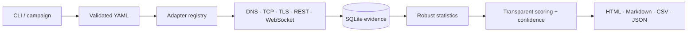

# Architecture

## Decision record ADR-001

**Decision:** implement the MVP as a Python 3.12 package with asyncio, declarative exchange adapters, HTTPX/WebSockets transports, Pydantic/YAML configuration, SQLite evidence storage, and Plotly static HTML output.

**Context:** Windows 11 is the primary runtime. The system must scale beyond ten venues without copying probe or scoring logic.

**Consequences:** adapters contain endpoint and wire-format knowledge only; probes produce common models; scoring consumes normalized observations. SQLite WAL mode supports durable local campaigns without requiring a server. High-frequency raw messages are summarized rather than retained.

## Boundaries

- `adapters.py`: declarative venue differences; no scoring.
- `probes.py`: network/application observations; no ranking.
- `storage.py`: schema and persistence; no transport behavior.
- `metrics.py` and `scoring.py`: derived facts and rankings.
- `reporting.py`: artifacts only.
- `runner.py`: bounded orchestration and safe cancellation.
- `market_quality.py`: normalized public order-book and market-suitability evidence.
- `campaign.py`: immutable, resumable local/UTC campaign windows.
- `diagnostics.py`: clock, anonymized network identity, and safe route diagnostics.
- `json_logging.py`: append-only structured operational events.

No private API or order method exists in the package.
